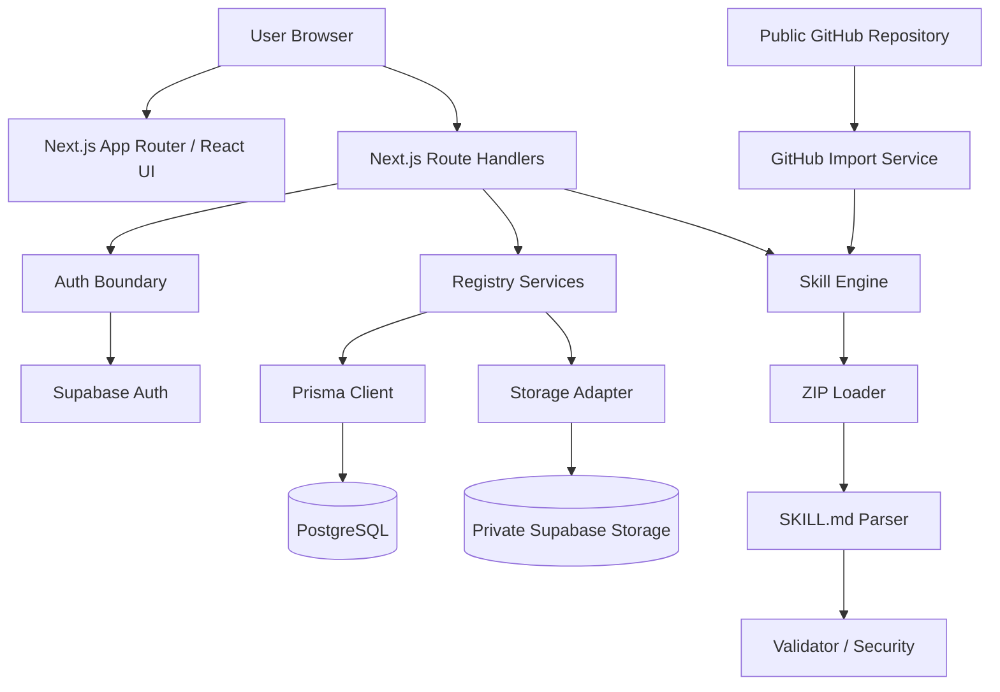

[README.md](https://github.com/user-attachments/files/32371309/README.md)
# Skill Hub

> 面向 AI Coding Agent Skill 的发现、导入、验证、发布、分享与管理平台。

Skill Hub 是一个面向 **AI Coding Agent Skill** 的 Web Registry / Marketplace，用于统一管理本地 ZIP 和公开 GitHub Repository 中的 Skill，并提供 Skill Discovery、Package Validation、Publishing、Version Management、Favorites 与 Download 等能力。

> 当前版本以 **User Web Access** 为主；专用 Agent Access API 尚未实现，列入 Roadmap。

## ✨ Features

- 🔍 **Skill Discovery** — Home、Explore、Search、Category、Sort 与 Skill Detail
- 📦 **ZIP Upload** — 上传 Skill Package 并生成 Validation Preview
- 🐙 **GitHub Import v1** — 从公开 `github.com` Repository 默认分支导入
- 🛡️ **Package Security** — 危险路径、Symlink、重复 Entry、大小/数量/深度等检查
- 📄 **SKILL.md Parser** — YAML Frontmatter + Markdown Body
- ✅ **Skill Validator** — Manifest 与 Package 结构校验
- 🚀 **Publish Flow** — 服务端重新验证后写入 PostgreSQL + Supabase Storage
- 🔐 **Authentication & Owner Permission** — Supabase Auth + 服务端 Owner 校验
- 🗂️ **Version History** — 多版本管理
- 📦 **Archive / Restore** — `PUBLISHED ↔ ARCHIVED`
- ⭐ **Favorites**
- ⬇️ **Skill Package Download**
- 📊 **Dashboard**

## 🏗️ Architecture



### Core Flow

```text
ZIP Upload / GitHub Import
          ↓
      ZIP Security
          ↓
    SKILL.md Parser
          ↓
       Validator
          ↓
 Validation Preview
          ↓
        Publish
          ↓
   Skill Registry
          ↓
Download / Owner Management
```

Preview 与 Publish 是独立步骤。Publish 时服务端会重新读取并验证 ZIP，不把客户端 Preview 当作安全边界。

## 📦 Skill Package

`SKILL.md` 是核心文件。常见结构：

```text
skill/
├── SKILL.md          required
├── scripts/          optional
├── references/       optional
├── assets/           optional
└── ...               extensible
    ├── evals/
    ├── examples/
    └── docs/
```

当前实现**没有目录白名单**。`evals/`、`examples/`、`docs/` 等安全路径可作为普通 Package 内容保留，但 MVP 不为这些额外目录赋予特殊语义。

最小示例：

```markdown
---
name: code-review
description: 帮助 AI Coding Agent 检查代码质量
---

# Instructions

Review the code and provide actionable suggestions.
```

Parser 当前处理的主要 Frontmatter 字段包括 `name`、`description`、`version`、`author`、`license`、`compatibility`、`metadata` 和 `allowed-tools`；其中 `name`、`description` 必填。

> Skill Hub 当前不会执行 Package 中的 scripts，也不会执行 GitHub Repository 中的代码，只负责解析、验证、存储和分发。

## 🛡️ Security

Skill Hub 将上传 ZIP 和外部 Repository 视为不可信输入。当前包含 Path Traversal / Zip Slip、Absolute Path、Windows Drive Path、Invalid Filename、Symlink、Duplicate Path、文件大小、Package Size、File Count、Directory Depth、Encrypted ZIP、Unsupported Compression，以及 GitHub Host / Redirect / Package Size / Timeout 等检查。

| Limit | Value |
|---|---:|
| Raw package size | 20 MiB |
| Single file size | 5 MiB |
| File count | 100 |
| Directory depth | 8 |

部分安全分支已实现但尚无独立自动化断言，例如 Compression Ratio、Encrypted ZIP、Unsupported Compression 和 Invalid Filename。

## 🧰 Tech Stack

| Layer | Technology |
|---|---|
| Language | TypeScript 5.7 |
| UI | React 19 |
| Framework | Next.js 15 |
| Styling | Tailwind CSS |
| ORM | Prisma 6 |
| Database | PostgreSQL |
| Authentication | Supabase Auth |
| File Storage | Supabase Storage |
| ZIP | `yauzl` / `yazl` |
| YAML | `yaml` |
| Testing | Vitest 5 |

结构化业务数据保存在 PostgreSQL；完整 Skill ZIP 保存在私有 Supabase Storage `skill-packages` Bucket。

## 🚀 Getting Started

```bash
git clone <your-repository-url>
cd skill-hub
npm install
```

根据 `.env.example` 配置环境变量。主要变量包括：

```env
SKILL_DATA_SOURCE=
DATABASE_URL=
SUPABASE_URL=
SUPABASE_SERVICE_ROLE_KEY=
NEXT_PUBLIC_SUPABASE_URL=
NEXT_PUBLIC_SUPABASE_PUBLISHABLE_KEY=
```

不要把数据库密码、Service Role Key、Token 等 Secret 提交到 Git。

Mock Registry：

```env
SKILL_DATA_SOURCE=mock
```

Database Registry：

```env
SKILL_DATA_SOURCE=database
DATABASE_URL="postgresql://..."
```

启动开发服务器：

```bash
npm run dev
```

Production：

```bash
npm run build
npm run start
```

真实 Publish / Download 还需要正确配置 Supabase Auth 和 Storage。当前仓库没有 Prisma Migration History，因此这里不假设不存在的 migration 命令。

## 📖 Usage

```text
Register / Login
      ↓
Home / Explore
      ↓
Skill Detail
      ↓
Create
  ┌───┴───────────────┐
  ↓                   ↓
ZIP Upload       GitHub Import
  └────────┬──────────┘
           ↓
  Validation Preview
           ↓
         Publish
           ↓
      Skill Detail
       ┌───┴─────┐
       ↓         ↓
    Download   Dashboard
                 ↓
       Version / Archive / Restore
```

Upload Preview 与 GitHub Import Preview 本身不要求登录；真正 Publish 需要有效 Supabase Auth Session。

## 🐙 GitHub Import v1

**支持：** Public Repository、`github.com`、Default Branch、Root Skill layout、Archive 获取、Package Size precheck、Trusted Host Redirect validation，以及复用 ZIP / Parser / Validator。

**暂不支持：** Private Repository、OAuth / Token、Branch / Tag / Commit selection、Subdirectory、Monorepo Skill selection、Repository Sync。

GitHub Import **不使用 `git clone`，也不会执行 Repository code**。Import Route 返回 Validation Preview 与规范化 `packageBase64`，前端将其转换为 File 后再进入统一 Publish API。

## 🗃️ Data Model

Prisma Schema 当前包含 **8 个 Model** 和 **2 个 Enum**：

```text
User 1 ───── N Skill
User 1 ───── N SkillFavorite N ───── 1 Skill
Category 1 ─ N Skill
Skill 1 ──── N SkillVersion
SkillVersion 1 ── N SkillFile
Skill N ──── N Tag (via SkillTag)
```

核心 Model：`User` · `Skill` · `SkillVersion` · `SkillFile` · `Category` · `Tag` · `SkillTag` · `SkillFavorite`

Skill 生命周期：

```text
PUBLISHED → Archive → ARCHIVED → Restore → PUBLISHED
```

Schema 还包含 `DRAFT`，但当前没有完整 Draft 工作流。

## 🔌 Current API Surface

| Method | Path | Purpose |
|---|---|---|
| `PATCH` | `/api/skills/[slug]` | Owner 编辑 Skill |
| `POST` | `/api/skills/[slug]/archive` | Archive |
| `POST` | `/api/skills/[slug]/restore` | Restore |
| `GET` | `/api/skills/[slug]/download` | 下载 Package |
| `GET` | `/api/skills/[slug]/favorite` | Favorite 状态 |
| `POST` | `/api/skills/[slug]/favorite` | 添加 Favorite |
| `DELETE` | `/api/skills/[slug]/favorite` | 移除 Favorite |
| `POST` | `/api/skills/upload` | ZIP Validation Preview |
| `POST` | `/api/skills/github/import` | GitHub Import Preview |
| `POST` | `/api/skills/publish` | 发布 Skill / Version |

当前没有 `GET /api/skills`、Agent Discovery API、Agent API Key API 或 Admin Review API；公开页面主要通过 Server Logic 读取 Registry。

## 🧪 Testing & Quality

源码审计时的实际验证结果：

| Check | Result |
|---|---|
| Vitest | **25 files / 163 tests passed** |
| TypeScript | **PASS** |
| Prisma Validate | **PASS** |
| Next.js Production Build | **PASS** |

自动化测试覆盖 Parser、Validator、ZIP Security、Upload、GitHub Import、Publish、Owner Permission、Version History、Archive / Restore、Favorites、Download、Auth 与 Navigation 等模块。

当前测试主要使用 Mock / Dependency Injection；仓库中没有 Playwright / Cypress 浏览器级 E2E，也没有连接真实 PostgreSQL、Supabase Storage 或 GitHub API 的外部系统自动化 E2E。

## 📂 Project Structure

```text
app/                    Next.js Pages / Route Handlers
components/             React UI Components
lib/
├── auth/               Server Authentication
├── db/                 Prisma Client
├── diagnostics/        Development Timing
├── registry/           Registry / Publish / Management
├── skills/             Parser / Validator / ZIP / GitHub Import
├── storage/            Supabase Storage Adapter
└── supabase/           Supabase Browser / Server Clients
prisma/
├── schema.prisma
└── seed.ts
tests/                  Vitest Tests
docs/                   Project Documentation
```

## ⚠️ Current Limitations

- 尚无 Agent Access API / Agent Authentication
- GitHub Import 仅支持 Public Repository + Default Branch
- 不支持 GitHub subdirectory / monorepo selection / sync
- AI Skill Builder 当前是本地 Mock，不调用真实 LLM
- Blank Create 尚未实现完整编辑器
- Favorite relation 当前不会同步 `Skill.stars`
- Explore 主要在客户端过滤，没有后端分页 / 全文检索
- 没有 Admin / Moderation 流程
- 没有应用级 Rate Limiting
- 没有正式 Production Observability
- 没有 Prisma Migration History
- 没有 Docker / amd64 Image
- ZIP / GitHub normalized package 当前以内存方式处理

## 🗺️ Roadmap

- 🤖 Agent Access API：Discovery / Detail / Version / Download
- 🔑 Agent Authentication：API Key / OAuth / Scope
- 🐙 GitHub Import v2：Private Repo、Branch、Subdirectory、Monorepo、Sync
- ✨ AI-assisted Skill Creation：接入真实 LLM，并复用 Validation Pipeline
- 🔎 Semantic Search：Embedding、Filter、后端 Pagination
- 🛡️ Production Hardening：Rate Limit、Audit、Observability、Storage Consistency
- 🗄️ Prisma Migration Baseline
- 🐳 Docker / amd64 Image


## 🎓 Project Context

Skill Hub 是一个 **AI Coding 课程项目**。开发过程中使用 AI Coding / Codex 辅助需求实现、代码开发、测试、问题定位和性能优化，并通过自动化测试、人工验收与 Git 版本管理保证修改可验证、可追踪、可回退。

```text
Requirement
    ↓
AI Coding / Codex
    ↓
Implementation
    ↓
Automated Test
    ↓
Human Acceptance
    ↓
Git Commit
    ↓
GitHub Push
```

核心 MVP 可运行后建立了 Git Baseline：

```text
7d2429a chore: establish Skill Hub MVP baseline
```

随后继续迭代 Favorites、Dashboard、Navigation / Auth 性能优化与 Secure GitHub Import。

---

**Skill Hub — from reusable Agent Skills to a manageable Skill Registry.**
